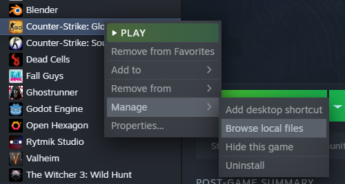

# How to get map load screen images

This is how it will look:

## Steps

1. Download the repo: https://github.com/Sayt123/CSGO-Surf-Load-Screens (Code - Download Zip)

2. Browse local files CSGO (right click CSGO - Manage - Browse local files)

   

3. Go to `csgo/resource/overviews/`
4. Copy/move all the `.dds` image files from the downloaded repo `/images/` into `/overviews/`
5. The image will load once you join a server
